# Project : Flask backend product store app

The project of the app consist of a CRUD API configured with a connection to a mysql database.
In this project, I developed the following:
- A Flask API to handle CRUD operations on products in the database (a Docker mysql database) and their tests.
- IAC : configuration and provision of a vm using vagrant
- Build and publish a docker image to my docker hub repository
- Container orchestration with docker-compose
- Docker orchestration using Kubernetes
- Service mesh with istio
- Monitoring with Prometheus and Grafana
- All wrap in Azure Devops and CI/CD pipeline to test and deploy the container app to  my docker hub repository.

In the following, I will explain how to run the app after cloning it on your own workspace.

## 1- Run the API locally

To run the API locally, make sure you have a mysql server running either a service on your machine or you can pull a mysql image and run it on a docker container.

RUN `pip install -r app/requirements.txt`. 
Create a .env file in the root project directory where you will define and store your secret credentials (use exactly the same key names):
- DB_HOST=your_host (ex: localhost)
- DB_PORT=your_port (ex :3306)
- DB_ROOT_USER=root
- DB_USER=your_user
- DB_PASSWORD=your_password
- DB_NAME=your_database_name (ex: product_store)
Then run `python run.py`.
You can test the endpoints using Postman or the curl command on a terminal.
For exemple, the health endpoint :

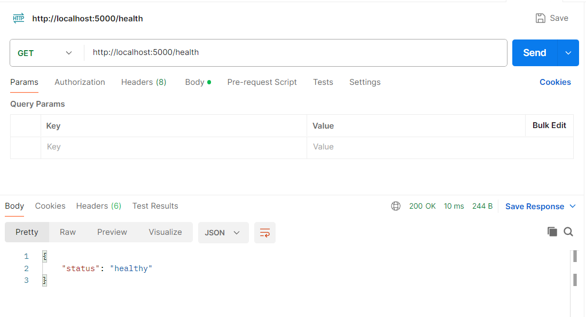

## 2- Configure and provision with vagrant

To configure and provision a vm using vagrant, you need to install vagrant on your machine and make sure you have virtualbox also installed on your computer.
Once installed, you need to define secret as well for your mysql database credentials (username, password and database name).
For that, go to provisioning/roles/database/tasks/ and define a yaml file called "vars.yml".
In that file, write:
db_name: your_database_name
db_user: your_username
db_password: your_password.

Then, go to the root project directory and run "vagrant up" to provision the vm.
Wait for the provision, and after it, you should see a vm running in your virtualbox app.

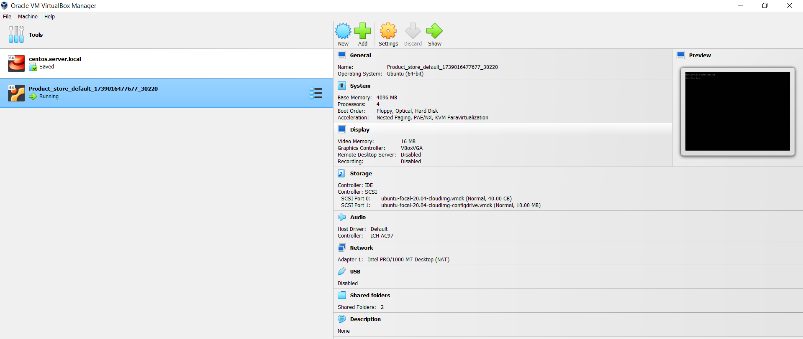

You can also test an endpoint locally using postman:

Explanation : The vagrantfile will provision the vm with the necessary resources and the main.yml files in each roles will confire it.
The common main yaml file will install dependencies like python, git, curl.
The database main yaml file will install mysql server, start it and configure it with the credentials defined in the vars.yml, create the database, create the user with his password and grant all priviledges on the database on all hosts.
The backend main yaml file will install the requirements.txt, add the app folder in the PYTHONPATH, go to root of the project and run the application entry point (run.py).

## 3- Build and publish a docker image

To build and publish a docker image, you need to have a Dockerfile in the root project directory, you need to have a docker hub account and of course, docker installed on your local machine.
To build and publish, you first need to login into your docker hub account : 
Type `docker login` and provide your credential when prompted.
To build : `docker build -t <your_dockerhub_username>/<repository_name>:<tag>` .
To push : `docker push <your_dockerhub_username>/<repository_name>:<tag>`
To test locally : `docker run -d -p 5000:5000 \
   -e DATABASE_URL="Your_database_url" \
    <your_dockerhub_username>/<repository_name>:<tag>`
If you don't have the image in your local machine, you need to pull it with `docker pull <your_dockerhub_username>/<repository_name>:<tag>`
Example : for my image, execute : 
- `docker pull bradesteve/product-store-backend`
- `docker run -d -p 5000:5000 \
#   -e DATABASE_URL="your db url" \
#   bradesteve/product-store-backend`

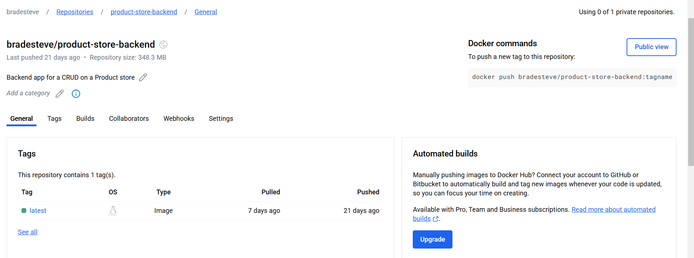

## 4- Container orchestration with docker-compose

To container orchestration with docker-compose, you need to have a docker-compose.yml file in the root.
The application will consist of two containers: One for the backend file and one for the mysql database.
First of all, in the .env file, add the mysql database secret information :
MYSQL_ROOT_PASSWORD=root
MYSQL_DATABASE=your_db
MYSQL_USER=your_user
MYSQL_PASSWORD=your_password

Since the database needs to be available first for the backend to access it, I added a "wait-for-it.sh" script file that will force the backend container to wait until the availability of the database container before it starts.
To build the app, you can either run : 
- `docker build --build-arg DB_USER=your_user --build-arg BD_PASSWORD=your_password --build-arg DB_HOST=your_host --build-arg DB_PORT=your_port --build-arg DB_NAME=your_db_name  -f Dockerfile .` and `docker compose up`
- In bash, `DB_USER=your_user BD_PASSWORD=your_password DB_HOST=your_host DB_PORT=your_port DB_NAME=your_db_name docker compose up --build`

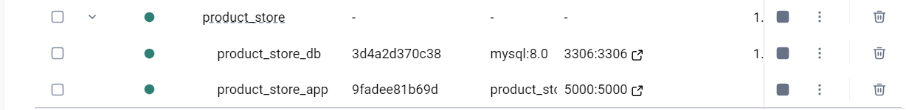

## 5- Docker orchestration using Kubernetes

To orchestrate with kubernates, you need to install "minikube" and launch docker.
1. Run `minikube start`
2. Navigate to k8s/database/, in mysql-secret.yml at the data section, replace MYSQL_USER and MYSQL_PASSWORD values with the Base64 encoded of your desired username and password.
3. Apply all the configurations by running : 
- `kubectl apply -f k8s/database/mysql-secret.yml`
- `kubectl apply -f k8s/database/mysql-pv.yml`
- `kubectl apply -f k8s/database/mysql-deployment.yml`
- `kubectl apply -f k8s/database/mysql-service.yml`
- `kubectl apply -f k8s/backend/backend-deployment.yml`
- `kubectl apply -f k8s/backend/backend-service.yml`
You can get the satuts of the deployment and services by running respectively `kubectl get pods` and `kubectl get svc`
4. To access the backend, you can run `kubectl port-forward svc/backend-service 5000:5000`. This will forward the 5000 port from minikube to port 5000 of your local machine.

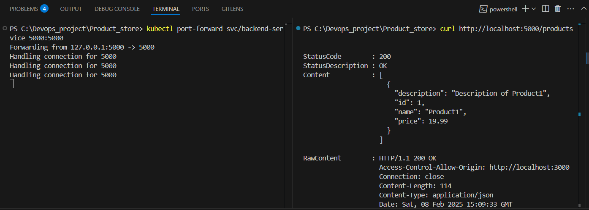

## 6- Service mesh with istio

To configure service mesh with istio, you first need to download istio on your local machine, add it to yout path and start minikube.
Then you need to set the demo profile by running : ``istioctl install --set profile=demo -y`.
Then enable sidecar injection in the default namespace: `kubectl label namespace default istio-injection=enabled`.
My service mesh configurtation constist of two deployments of the backend app, a deployment of the mysql database, a gateway to receive all incoming traffic and a destination rule to forward the traffic to the two backend deploymant app (50-50 in my case).
To apply the configurations, run :
- `kubectl apply -f k8s/backend/backend-v1v2-deployment.yml`
- `kubectl apply -f k8s/istio/gateway.yml`
- `kubectl apply -f k8s/istio/destinationrule.yml`
- `kubectl apply -f k8s/istio/virtualservice.yml`
With this configuration, I have two versions of my backend app where I redirect 50% of the traffic.
To test it, instead of using port forwarding this time (`kubectl port-forward -n istio-system service/istio-ingressgateway 8080:80`),I will use `minikube tunnel` and get an external IP address.
Run `minikube tunnel` to create a tunnel and `kubectl get svc istio-ingressgateway -n istio-system` to get the external ip.

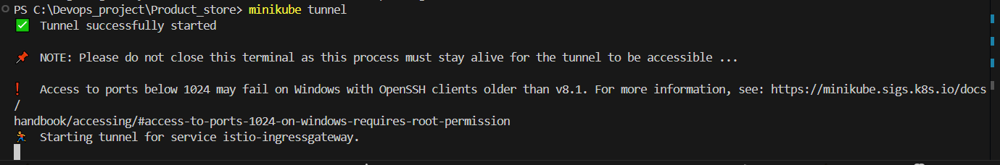

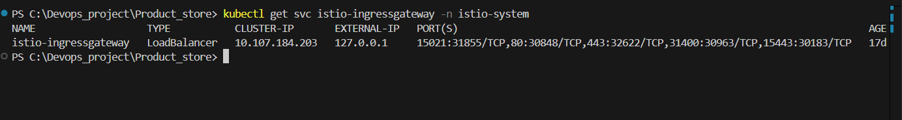

Then run `for i in {1..10}; do curl -s http://<external ip>/health; echo; done` in a bash terminal.

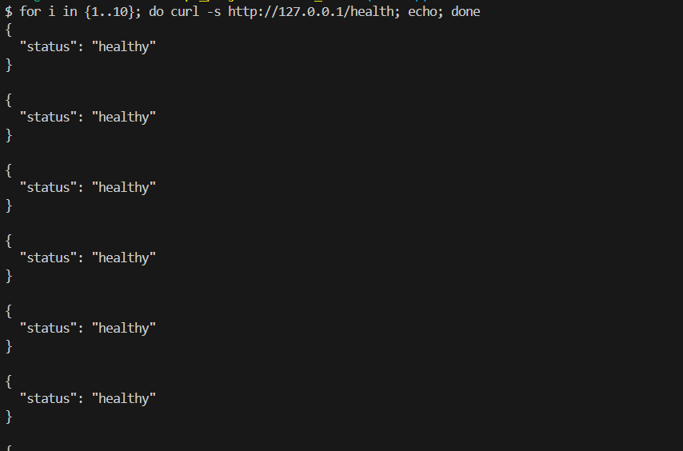

To test the load distribution, check the deployment log:
run `kubectl logs -l app=product-store,version=v1` `kubectl logs -l app=product-store,version=v2`

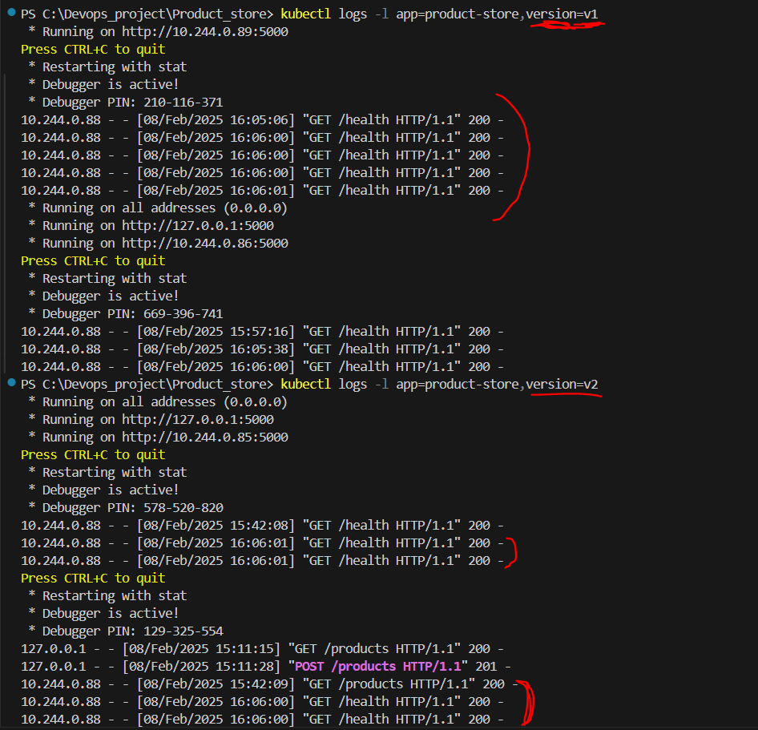

That's it for service mesh with istio :).
Note!! : All the backend deployments are pulling my backend flask app from image in docker.

## 7- Monitoring with Prometheus and Grafana

To monitor the application, the health endpoint especially, I deployed a prometheus service where I create a status tagert using the health endpoint of my backend app. After I monitored the health status of the app with prometheus, I connected it with Grafana to monitor the health also and create an alert on the health status of the app.
For all the monitoring process, I created a separate namespace for it : "monitoring". The command is `kubectl create namespace monitoring` 

1. Let's start with the Prometheus configuration : 
For the prometheus configuration, I created a prometheus deployment by pulling its latest image from dacker ("prom/prometheus:latest") and created the prometheus service associated.
Another important step is to create a json-exporter deployment and service because my health endpoint returns a json and not a text.
I associated a config.yml file to the json-exporter deployment to scrape the url endpoint of the health enpoint:
"scrape_url: http://backend-service.default.svc.cluster.local:5000/health" (since we are not in the same namespace, I need to specify the service and the namespace).
After defined the json-exporter and defined the scrape_url for the health endpoint, it is now time to attach the new json-exporter endpoint to the prometheus deployment ('json-exporter-service.monitoring.svc.cluster.local:7979').
To resume, the json-exporter scraps the rigth health endpoint url from the backend service, produce another endpoint that is being scraped by the prometheus deployment. So finally, to scrap the health endpoint, you need to scrap 'json-exporter-service.monitoring.svc.cluster.local:7979'.
To apply the configurations, run :
- `kubectl apply -f k8s/monitoring/config.yml`
- `kubectl apply -f k8s/monitoring/json-exporter.yml`
- `kubectl apply -f k8s/monitoring/json-exporter-service.yml`
- `kubectl apply -f k8s/monitoring/prometheus-deployment.yml`

Then run : `kubectl port-forward -n monitoring svc/prometheus-service 9090:9090`

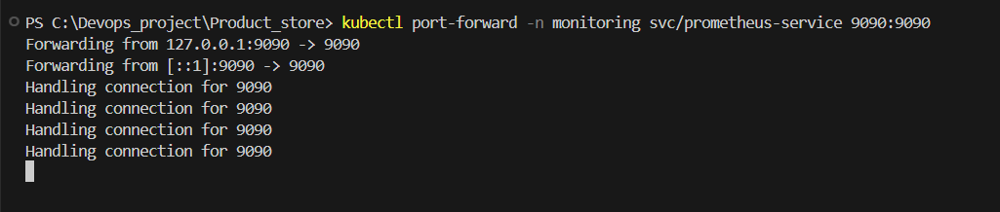

And access the prometheus web interface at `http://localhost:9090`

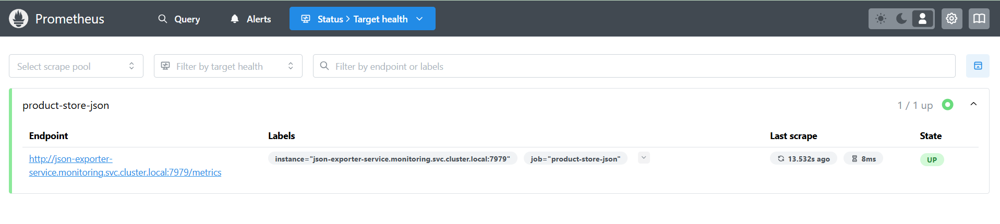

We can see that the target health is UP (1/1 up) so the app is running well.

2. Let's move to the Grafana configuration :

Like Prometheus, for Grafana configuration, I also created a deployment by pulling the grafana image from docker (grafana/grafana:latest) and create a grafana service associated.
For the monitoring with Grafana, I linked the Grafana server to the prometheus one and created an alert for the health status for not responding for more than 1 minute.
To apply the configurations, run :
- `kubectl apply -f k8s/monitoring/grafana-deployment.yml`
- `kubectl apply -f k8s/monitoring/grafana-service.yml`

To connect to Grafana, connect prometheus and watch the alert, we need to access it.
We run : `minikube service grafana-service -n monitoring`. That will open a page in the browser asking you to provide credentialfor login: type admin for the username and password. You will be also prompted to change the password.
To link prometheus to Grafana, go to "Data sources" and create a new prometheus data source.
Paste the the connection url of the prometheus server : "http://prometheus-service.monitoring.svc.cluster.local:9090"
Go at the bottom of the page and click "Save & test".

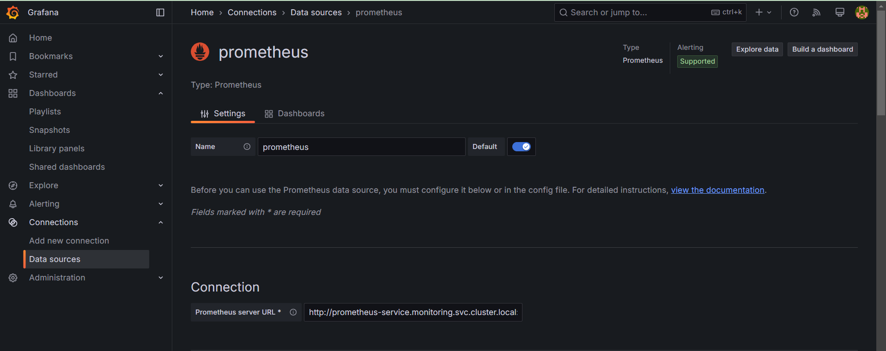

We can even create dashboards on the web page : 

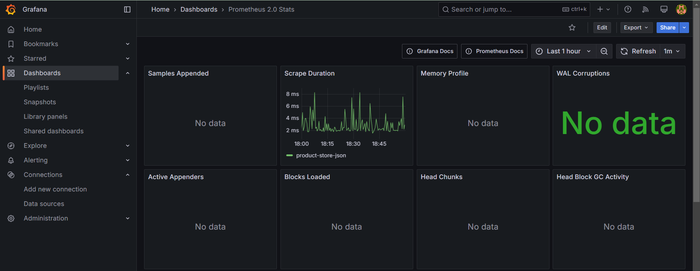
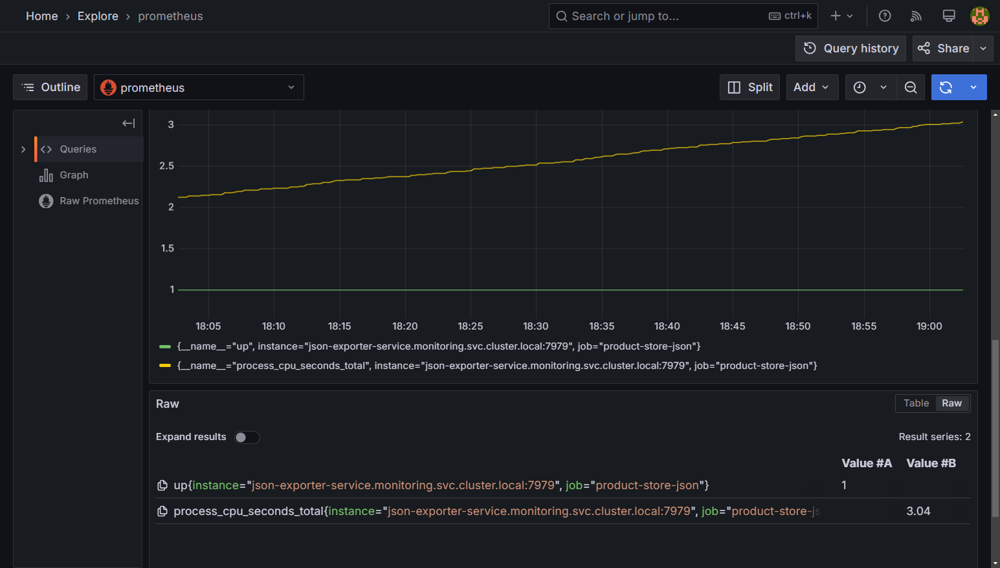

To define the alert rule, I directly defined it in the prometheus deployment under the data section (alert_rules.yml).
The alert is triggered when the app is down for more than 1 minute.
We can see it in the prometheus and Grafana page since they are linked together:
Prometheus: 
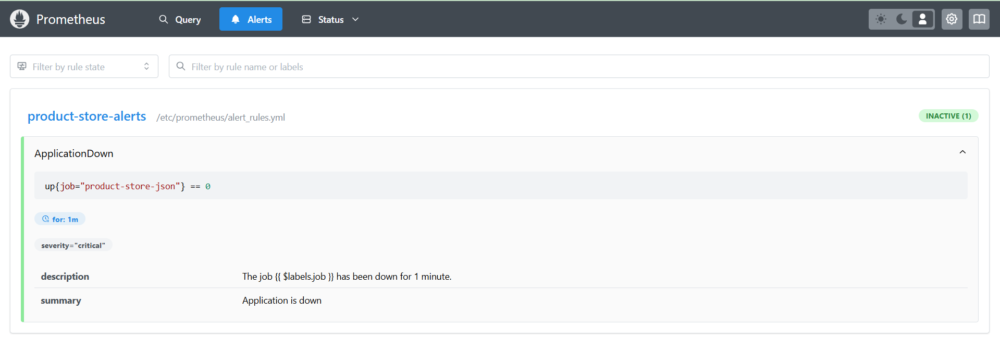

Grafana:
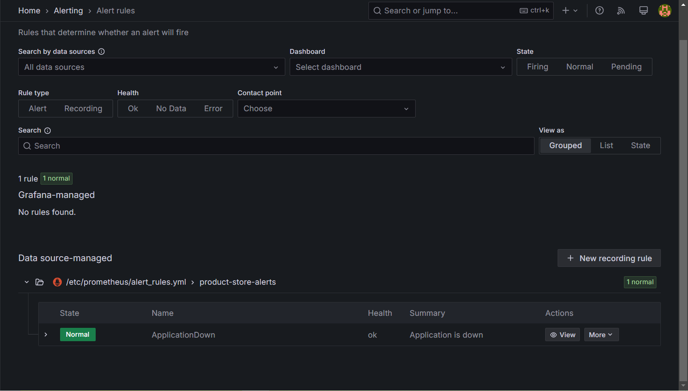

Here we can notice tha the alert has the staus "Normal" which indicates that the app is running well.
To test the alert, we will scale down the app and wait for 1 minutes to see what happens.
To scale down the app, we run : `kubectl scale deployment json-exporter --replicas=0 -n monitoring`
Then we wait for 1 minute to see the alert triggered.
After 1 minute, we can see that the alert is triggered and the status is "Firing" and that the application is down.

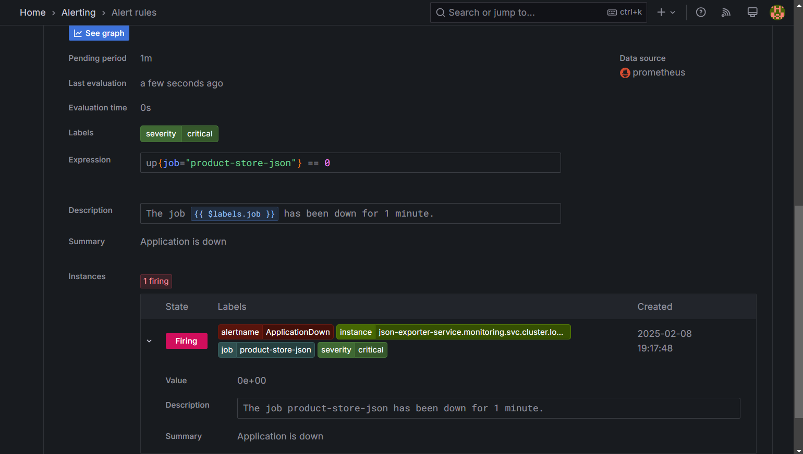

We can now confirme that the alert works fine.

## 8- CI/CD pipeline

All the application code is verssioning using git on Azure Devops.
For the CI/CD pipeline, I merged the two parts in one file because I was running the pipeline in my local machine with my own resources instead of the cloud.
The CI runs the test with pytest, build the the container app and push it to my docker repository.
The CD part is not implemented because I am only working on a dev environment.
To run the pipeline, I first need to launch on my machine the agent that will be responsible to execute the pipeline.
To create an agent to run your pipeline with your personalcomputer, read [personnal agent](https://learn.microsoft.com/en-us/azure/devops/pipelines/agents/windows-agent?view=azure-devops)

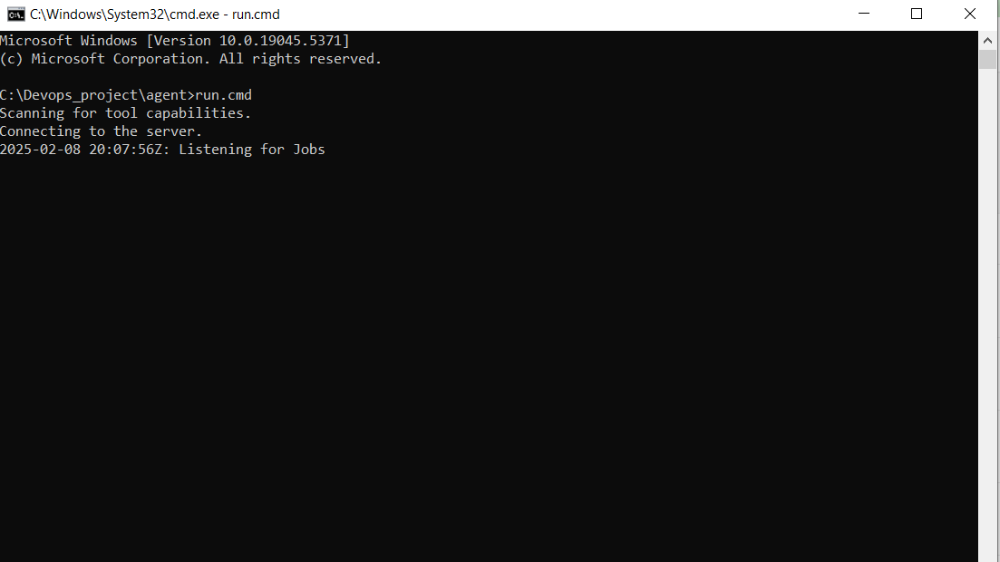
we see that the agent is listening for job, let's trigger our pipeline.
Our pipeline is triggered when a pull request is created and the code is merged in the main branch.
!! You need tohave docker running on your computer if you execute with an agent too.

I create a pull request on the main 
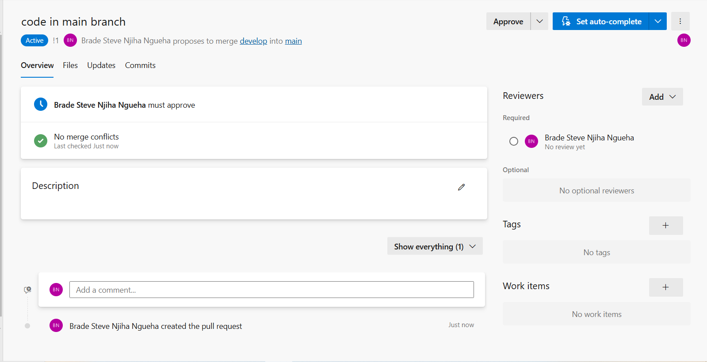

I approved and complete the PR, that triggered the pipeline
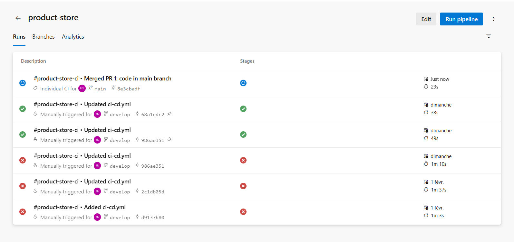

The pipeline runs succesfully 
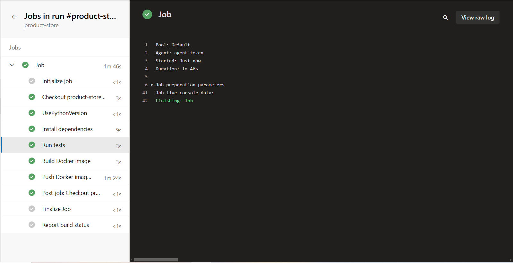
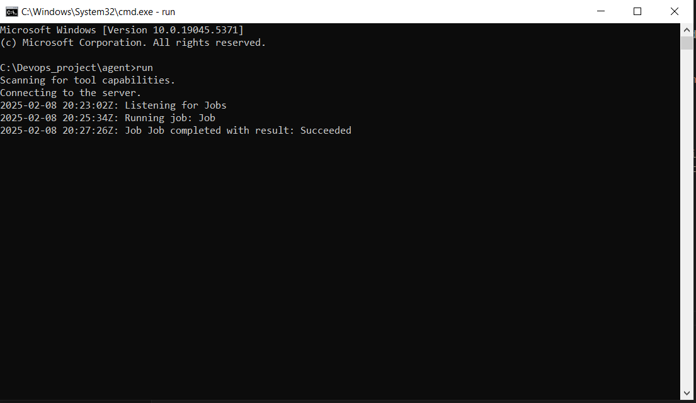

And the image is being pushed on my docker repository with a tag number and the latest tag.
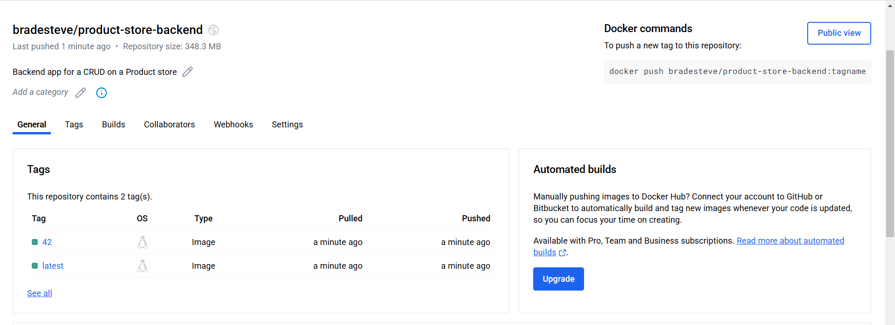

And that's all for the project :).